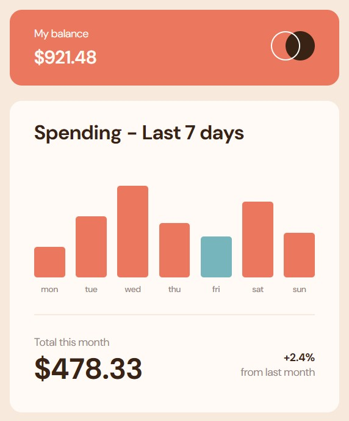

# Frontend Mentor - Expenses chart component solution

This is a solution to the [Expenses chart component challenge on Frontend Mentor](https://www.frontendmentor.io/challenges/expenses-chart-component-e7yJBUdjwt). Frontend Mentor challenges help you improve your coding skills by building realistic projects.

## Table of contents

- [Overview](#overview)
  - [The challenge](#the-challenge)
  - [Screenshot](#screenshot)
  - [Links](#links)
- [My process](#my-process)
  - [Built with](#built-with)
  - [Useful resources](#useful-resources)
- [Author](#author)

## Overview

### The challenge

Users should be able to:

- View the bar chart and hover over the individual bars to see the correct amounts for each day,
- See the current day's bar highlighted in a different colour to the other bars,
- View the optimal layout for the content depending on their device's screen size,
- See hover states for all interactive elements on the page,
- Bonus: See dynamically generated bars based on the data provided in the local JSON file.

### Screenshot

### Links

- Solution URL: https://github.com/mateusz-przybyla/Expenses-chart-component.git
- Live Site URL: https://mateusz-przybyla.github.io/Expenses-chart-component/

## My process

### Built with

- Semantic HTML5 markup
- Vanilla CSS
- Flexbox
- Mobile-first workflow
- DOM Manipulation
- JSON
- index.js file -> using vanilla JavaScript (fetch API, using async/await)
- index-jq.js file -> using jQuery library (jQuery.getJSON() method)

### Useful resources

- [Web Development Bootcamp](https://www.udemy.com/course/the-complete-web-development-bootcamp/?couponCode=KEEPLEARNING) - The Web Development Bootcamp in which I am taking part.
- [MDN Web Docs](https://developer.mozilla.org/en-US/) - My best website which help me understand rules and features about HTML, CSS and JavaScript languages.
- [Fetch API](https://kursjs.pl/kurs/ajax/fetch)
- [jQuery.getJSON()](https://api.jquery.com/jQuery.getJSON/)

## Author

- Frontend Mentor - [@mateusz-przybyla](https://www.frontendmentor.io/profile/mateusz-przybyla)
